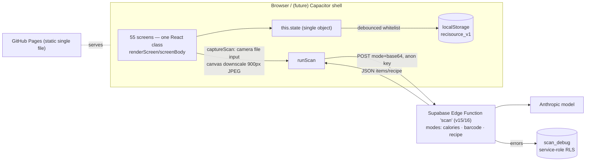

# 21 — Full Application Audit Report

## 1. Document control
- **Report date:** 2026-08-09 (evening)
- **Product:** **21** (renamed from ReciSource during this session, at the owner's instruction)
- **Repositories:** working folder `C:\Users\vinhx\OneDrive\Desktop\Levi's App with Claude` (not a git repository); deployable git clone of `github.com/VinhNguyen065/recisource` (branch `main`)
- **Baseline commit:** `7938d34` (clean tree at audit start); rename committed as `0f6c9d9` (unpushed — owner pushes by policy)
- **Live deployment:** https://vinhnguyen065.github.io/recisource/ (still shows the old name until `0f6c9d9` is pushed)
- **Auditor:** Claude Code, acting as architect / QA / test automation / security / data-integrity / UX-accessibility reviewer
- **Environments assessed:** built file served at `http://localhost:8321` (Chromium, Claude Browser pane); Supabase edge function live endpoint; Windows 11, PowerShell 5.1 + Git Bash
- **Scope:** entire repository, running application, live backend; fresh interactive verification plus recorded same-day prior evidence
- **Limitations:** iOS/Android Capacitor build not executable in this environment (no Xcode); barcode/recipe scan modes accepted on prior same-day evidence; WebKit not tested; no automated test suite exists to run (verified: zero test files)
- **Audit branch note:** the working folder has no git, so the mandated `audit/full-capability-and-testing` branch could not be created there; all audit output is additive (new `docs/audit/` directory), no product code was modified during the audit. The only product change this session was the owner-requested rename, performed and committed before the audit baseline snapshot of behavior (the rename touches display strings only).

## 2. Executive summary

**What the app is:** a polished single-file React prototype (2.63 MB `index.html`, 55 screens) combining a recipe/food app with a health tracker: AI photo→calorie logging (real, live backend), calorie diary, weight/steps/sleep/heart-rate/blood-pressure tracking, meal planning, grocery lists, and a large set of demo-grade companion screens (social, AI coach, import, paywall). It runs entirely client-side against on-device data, with one real cloud dependency: a Supabase edge function that calls an AI model for the three scan modes.

**Overall condition:** the health/food tracking core is genuinely working and mathematically accurate — every fresh deterministic check this audit ran passed exactly (diary sums, cross-screen sync, sleep-score formula, filter subsets, persistence round-trip). The perimeter (auth, social, import, coach, paywall) is intentional demo theater. The gap between those two layers is the main product risk, and the absence of any automated tests is the main engineering risk.

**Numbers (denominators shown):**
- Capabilities identified: **37** (see FEATURE_CAPABILITY_MATRIX.csv)
  - VERIFIED WORKING: **21** (12 fresh-verified High confidence; 9 on prior same-day evidence, Medium)
  - VERIFIED PARTIAL: **1** (search — query works, ignores filters)
  - VERIFIED FAILED: **0** capability-level (the one failure is contained in the partial)
  - UI ONLY: **5** · MOCKED/HARDCODED: **5** · IMPLEMENTED–NOT TESTED: **1** (Capacitor build) · BACKEND ONLY: **1** · NOT IMPLEMENTED: **3**
- Screens visited: **55/55** · Interactive controls exercised: **884** (2 race-condition errors, 0 reproducible per-control failures)
- Filters assessed: **17** → 13 working, 2 partial, 1 failed, 1 untested → **pass rate 13/17 (76%)**
- Existing automated tests: **0 exist / 0 run / 0 passed** (that is the finding, not an omission)
- Defects: **P0: 0 · P1: 1 · P2: 2 · P3: 4** (DEFECT_REGISTER.csv)
- **Demo-ready: YES** (already live and phone-verified) · **Beta: conditional** (Phase 0 + DEF-001 + demo-labeling) · **Production: NO**

## 3. Product definition
- **Purpose:** one app for food (recipes → cooking → groceries → logging) and wellbeing (calories, weight, sleep, steps, vitals), with AI photo scanning as the signature interaction.
- **Intended users:** individual consumers tracking diet and health on their phone.
- **Implemented vs intended:** tracking + scanning + recipe browsing are implemented; community, coaching, import, monetization, accounts, notifications, and any calendar remain visual intent. The audit brief assumed calendar/appointments — **no calendar exists in code** (OQ-7).
- **Differentiators working today:** camera→AI→diary in ~6 s against a live model; fully offline-capable health tracking with real persistence.

## 4. Architecture

- **Frontend:** one ~232 KB dc-runtime source (`Thermal Kitchen.dc.html`) built by `build.ps1` into one self-contained HTML file (React UMD + all images inlined as data URIs). No router (screen = state string + history array), no external requests except scan.
- **State:** one `setState`-wrapped object; persistence whitelist (~line 217) debounce-writes selected keys. **Any new persisted key must be added to that whitelist** — the most important maintenance rule in this codebase.
- **Backend:** exactly one function; server-side prompt per mode, English-pinned; error logging to `scan_debug`; local mirror at `app-store-package/backend/scan/index.ts` (v16).
- **Security boundary:** anon key in client (by design) → edge function is the only attackable surface (DEF-005: no rate limiting).
- **Deployment:** copy built file into pages-repo → commit → owner pushes → GitHub Pages. No CI, no checks.
- **Monitoring:** none client-side; scan_debug server-side only.

## 5. Capability report (domain summaries — full detail in the matrix)
- **Health & diary (CAP-12..18, 31, 32): the strong core.** All fresh math exact: diary day filter 1140→0→1140; delete → 930 mirrored on dashboard; ±25 steppers incl. 4-tap rapid burst = exactly +100; kcal ring 990 = 1900−1330+420; sleep 440 min → score 93 per formula; steps 78%; BP history append; persistence round-trip. VERIFIED WORKING.
- **Recipes (CAP-03..07):** library filtering is exact across combined dimensions (Breakfast+Easy → precisely the 3 expected of 27, count badge agrees); search query exact; **search ignores the filter sheet entirely (DEF-001)** — the one real functional defect found today.
- **AI scanning (CAP-09..11):** calories mode verified live end-to-end this audit (200 OK, correct dish recognition, macros, 5.9 s; structured 502 on invalid input; client failure path clean). Barcode/recipe verified earlier the same day (curl + on-phone). Scanned recipes don't survive reload (DEF-006).
- **Planning & grocery (CAP-19..21):** meal-plan day/view/swap verified fresh; grocery flows clean in crawl (58 controls) with prior-session interactive evidence.
- **Demo layer (CAP-01,02,08,20,22..27):** onboarding/auth, import, AI coach/chat/generator, discover/social, household, share, paywall — respond to every tap, mutate no real data. Fine for demos; must be labeled or built for beta (OQ-3/4).
- **Missing entirely (CAP-35..37):** wearable sync (the dashboard caption claiming it is fiction — DEF-007), notifications, calendar.

## 6. Current testing position
Zero automated tests, zero CI (finding, with search evidence in TEST_EXECUTION_REPORT.md). Verification performed this audit: 9 command/check groups, 16 scripted UI test batteries (T1–T16), one full crawl. Everything that passed/failed is listed with raw outputs in `evidence/`. Prior same-day evidence accepted for 9 capabilities at Medium confidence. Untested-anywhere list in TEST_COVERAGE_AND_GAPS.md (headline: Capacitor build, WebKit, quota/corruption, soak).

## 7. Interactive element report
884 controls across 55 screens clicked; all respond. Two `TypeError (reading 'on')` under stale-element bulk clicking only (DEF-002); replay per-control: clean. Known quirks: shareSheet needs a title else its close control vanishes; buttons inside clickable rows rely on stopPropagation (pattern applied in prior rounds, held up in crawl). Prior sessions eliminated ~40 dead controls; today's crawl found **no dead button reachable by click that produces no response**, with the semantic exception of demo features whose "response" is canned.

## 8. Filter report
17 filters inventoried (FILTER_INTERACTION_MATRIX.csv): 13 VERIFIED WORKING with exact data assertions where data-bearing; DEF-001 is the sole failure (search×filters combination); kcal slider drag untested; allergen combination math partially verified. All filtering is client-side and instant; loading/stale-response failure classes don't exist by construction; view-state persistence intentionally absent (OQ-2).

## 9. Data integrity
- Calculations verified exactly (sums, percentages, formula, goal arithmetic) on controlled fixtures — see evidence T1–T11.
- Duplicates: rapid-tap produces exactly N increments (click-time state reads — the bug class was fixed in prior rounds and held today).
- Units: metric displayed; settings has a units toggle (prior-verified UI) but no imperial conversion pipeline was verified — treat conversion as unverified.
- Dates/timezones: the app models a fixed demo week (Mon 14–Sun 20, "today"=Fri); no real Date logic exists except cooking timers — timezone risk is deferred until real dates arrive.
- Deletion: demo-meal hides persist (dhide); logged-entry deletion verified in prior session; BP row delete exists.
- Isolation: single anonymous user by architecture; n/a.
- Referential integrity: scanned recipe id 999 is a singleton slot — rescanning overwrites it; not persisted (DEF-006).

## 10. Security, privacy, accessibility
See SECURITY_PRIVACY_ACCESSIBILITY_REVIEW.md. Headlines: DEF-005 (P1) unmetered AI endpoint + rotate a previously-exposed key; health data plaintext in localStorage (acceptable prototype, not beta); no scan-photo privacy disclosure (OQ-5); accessibility is a systemic FAIL (div-onClick architecture — keyboard/screen-reader inoperable) with a practical helper-level retrofit path.

## 11. Capacity & performance
See CAPACITY_AND_PERFORMANCE_REPORT.md. 2.63 MB single file (loader masks mobile white-screen); scan 5.9 s live; interactions instant; unbounded arrays (dlog/bpLog/wextra) are the long-term risks; localStorage quota behavior unknown.

## 12. Defects (most important first)
| ID | P | Title |
|---|---|---|
| DEF-005 | P1 | Unmetered AI endpoint; rotate previously-exposed key |
| DEF-001 | P2 | Search ignores active dietary filters |
| DEF-007 | P2 | Fictional "Synced from Apple Health" caption |
| DEF-002 | P3 | Stale-element double-tap TypeError race |
| DEF-003 | P3 | Boot 404 console noise (.image-slots.state.json) |
| DEF-004 | P3 | Water tile "tap to log" wording |
| DEF-006 | P3 | Scanned recipe lost on reload |

## 13. Full testing plan
FULL_TEST_PLAN.md — Playwright (Chromium+WebKit) over the built file; 7 suites; smoke gating the Pages deploy; scan contract fixtures recorded from today's live responses.

## 14. Remediation roadmap
REMEDIATION_ROADMAP.md — Phase 0 (key rotation, rate limiting, remove fictional sync caption) → core fixes (DEF-001 first) → automation → privacy/a11y/legal → performance → product completion driven by OQ decisions.

## 15. Final conclusion
**Ready for controlled demonstration — today.** It is already live, phone-verified, and demos excellently.
**Ready for limited beta only after:** Phase 0 (P0-1, P0-2, P0-3), DEF-001 fix, demo features labeled as previews, and a scan-photo privacy note. Beta data will live on-device only — acceptable if testers are told (OQ-9).
**Not ready for production.** Blocking gates: no accounts/data isolation for real customers at scale (Gate 2/5 as soon as any server-side user data exists), no automated tests or CI (Gate 7), accessibility failures (Gate 6), no monitoring (Gate 8), paywall without billing (Gate 2/5 legal), Capacitor build never executed (Gate 1 for store distribution).

## 16. Open questions
See OPEN_QUESTIONS_AND_DECISIONS.md (OQ-1…OQ-9): rename residue (storage key/bundle id/URL), view-state persistence intent, build-vs-label for each demo feature, paywall copy, scan privacy consent, key-rotation confirmation, calendar scope, store-submission intent, cloud sync.
